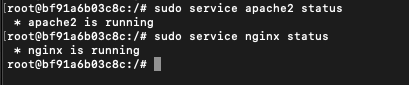

# 📘 DevOps Monitoring Project

This project covers the setup of a secure, monitored, and automated development environment. It includes system monitoring, user and permission management, and automated backups.

## 📦 Repository Details

- **Name:** `Assignment_on_Testing_Linux_and_Servers`  
- **URL:** [https://github.com/yogi9016/Assignment_on_Testing_Linux_and_Servers.git](https://github.com/yogi9016/Assignment_on_Testing_Linux_and_Servers.git)
- **Owner:** Yogeswaaran Panneerselvam (yogi9016)

---

# 🧩 Task 1: System Monitoring Setup


This guide helps you monitor CPU, memory, disk, and process usage on a Linux system using simple command-line tools. It includes a script that logs metrics every 12 hours and stores them in date-wise folders.

---

## 🔧 Installation

Install the required monitoring tools:

```bash
# Install htop
sudo apt install htop -y

# Install nmon
sudo apt install nmon -y
```

---

## 📊 Monitoring Tools

### ✅ htop

Interactive system monitor to view CPU, memory, and process usage.


---

### ✅ nmon

Performance monitor with CPU, memory, disk, and network stats.


---

## 💽 Disk Usage Monitoring

### ✅ df -h

Shows filesystem disk space usage in human-readable format.

```bash
df -h
```


---

### ✅ du -sh /

Shows the total disk usage of the root (`/`) directory.

```bash
du -sh /
```


---

## 📝 `monitor.sh` – Logging Script

Create a file named `monitor.sh` and paste the following:

```bash
#!/bin/bash

# Base log directory
BASE_LOG_DIR="/var/log/monitoring"

# Get today's date (e.g., 2025-07-06)
TODAY=$(date +%F)

# Create daily folder: /var/log/monitoring/2025-07-06
DAILY_LOG_DIR="$BASE_LOG_DIR/$TODAY"

# Create the directory if it doesn't exist
if [ ! -d "$DAILY_LOG_DIR" ]; then
    echo "Creating log directory at $DAILY_LOG_DIR"
    sudo mkdir -p "$DAILY_LOG_DIR"
    sudo chmod 755 "$DAILY_LOG_DIR"
fi

# Get current time for file naming
TIMESTAMP=$(date +%H-%M-%S)

# File paths
TOP_LOG="$DAILY_LOG_DIR/top_$TIMESTAMP.log"
DF_LOG="$DAILY_LOG_DIR/df_$TIMESTAMP.log"
DU_LOG="$DAILY_LOG_DIR/du_$TIMESTAMP.log"
PROCESS_LOG="$DAILY_LOG_DIR/process_$TIMESTAMP.log"

# Generate monitoring logs
echo "Collecting system monitoring data..."

# Top command (CPU/mem/processes)
top -b -n1 > "$TOP_LOG"

# Disk usage
df -h > "$DF_LOG"

# Root folder size
du -sh / > "$DU_LOG"

# Top 10 memory-hungry processes
ps -eo pid,ppid,cmd,%mem,%cpu --sort=-%mem | head -n 11 > "$PROCESS_LOG"

echo "Monitoring logs stored in $DAILY_LOG_DIR"
```

---

## 🚀 Run the Script

Make the script executable and run it:

```bash
chmod +x monitor.sh
./monitor.sh
```

**Output screenshots:**

  


---

## ⏰ Automate with Cron

To run the script every **12 hours**, open crontab:

```bash
crontab -e
```

Add this line:

```cron
0 */12 * * * /root/monitor.sh
```

> This runs the script at 00:00 and 12:00 daily.

---

## 📂 Log Output Structure


---

## ✅ Summary

| Tool       | Purpose                             |
|------------|-------------------------------------|
| htop       | Interactive resource monitoring     |
| nmon       | Detailed performance metrics        |
| df -h      | Disk usage per filesystem           |
| du -sh /   | Total usage of root directory       |
| top        | CPU, memory, process stats snapshot |
| ps         | Top memory-consuming processes      |

---

📌 Use this setup for continuous visibility into system health, early detection of issues, and capacity planning.


---

# 👥 Task 2: User Management and Access Control 

## Create Users with Secure Passwords

### Add users with home directories
```bash
sudo useradd -m sarah
sudo useradd -m mike
```

### Set passwords securely (will prompt for password input)
```bash
sudo passwd sarah
sudo passwd mike
```


---

## Create Isolated Workspace Directories

### Create the directories
```bash
sudo mkdir -p /home/sarah/workspace
sudo mkdir -p /home/mike/workspace
```

### Set ownership to respective users
```bash
sudo chown sarah:sarah /home/sarah/workspace
sudo chown mike:mike /home/mike/workspace
```

### Set permissions so only the owner can access
```bash
sudo chmod 700 /home/sarah/workspace
sudo chmod 700 /home/mike/workspace
```


---

## Set Password Expiration Policy

### Set password to expire in 30 days
```bash
sudo chage -M 30 sarah
sudo chage -M 30 mike
```

### Enforce Password Complexity
Edit the PAM configuration:
```bash
sudo vi /etc/pam.d/common-password
```

Add or modify this line:
```
password requisite pam_pwquality.so retry=3 minlen=8 ucredit=-1 lcredit=-1 dcredit=-1 ocredit=-1
```

**Explanation:**
- `minlen=8`: Minimum length
- `ucredit=-1`: Require at least 1 uppercase
- `lcredit=-1`: Require at least 1 lowercase
- `dcredit=-1`: Require at least 1 digit
- `ocredit=-1`: Require at least 1 special character

---

### Verify Password Policies
Check expiry details:
```bash
chage -l sarah
chage -l mike
```


---

### Test Access Controls
Switch to Sarah's account and try accessing Mike's workspace:
```bash
sudo su - sarah
ls ../mike   # This should give a permission denied error
```


---

# 🔄 Task 3: Backup Configuration for Web Servers


## Objective
Configure automated backups for Sarah's Apache server and Mike's Nginx server to ensure data integrity and recovery.

---

## 1. Install Apache and Nginx

### Update system packages
```bash
sudo apt update
```

### Install Apache
```bash
sudo apt install apache2 -y
```

### Install Nginx
```bash
sudo apt install nginx -y
```

### Start Apache and Nginx
```bash
sudo service apache2 start
sudo service apache2 status

sudo service nginx start
sudo service nginx status
```

> **Note:** Nginx is configured to listen on port `8080` instead of the default port `80` to avoid conflicts with Apache.



---

## 2. Create Backup Scripts

Create the `/backups` directory and assign permissions:
```bash
sudo mkdir -p /backups
sudo chown $USER:$USER /backups
```

### Apache Backup Script (for Sarah)
Create the script at: `/home/sarah/workspace/apache_backup.sh`

```bash
#!/bin/bash

DATE=$(date +%F)
BACKUP_DIR="/backups"
BACKUP_FILE="${BACKUP_DIR}/apache_backup_${DATE}.tar.gz"
VERIFY_LOG="${BACKUP_DIR}/apache_verify_${DATE}.log"

# Ensure backup directory exists
mkdir -p "$BACKUP_DIR"

# Create the verification log file if it doesn't exist
if [ ! -f "$VERIFY_LOG" ]; then
    touch "$VERIFY_LOG"
fi

# Perform the backup
tar -czf "$BACKUP_FILE" /etc/apache2/ /var/www/html/

# Verify the backup
echo "Apache backup verification - $DATE" > "$VERIFY_LOG"
tar -tzf "$BACKUP_FILE" >> "$VERIFY_LOG"
```

Make it executable:
```bash
sudo chmod +x /home/sarah/workspace/apache_backup.sh
```

### Nginx Backup Script (for Mike)
Create the script at: `/home/mike/workspace/nginx_backup.sh`

```bash
#!/bin/bash

DATE=$(date +%F)
BACKUP_DIR="/backups"
BACKUP_FILE="${BACKUP_DIR}/nginx_backup_${DATE}.tar.gz"
VERIFY_LOG="${BACKUP_DIR}/nginx_verify_${DATE}.log"

# Ensure backup directory exists
mkdir -p "$BACKUP_DIR"

# Create the verification log file if it doesn't exist
if [ ! -f "$VERIFY_LOG" ]; then
    touch "$VERIFY_LOG"
fi

# Perform the backup
tar -czf "$BACKUP_FILE" /etc/nginx/ /usr/share/nginx/html/

# Verify the backup
echo "Nginx backup verification - $DATE" > "$VERIFY_LOG"
tar -tzf "$BACKUP_FILE" >> "$VERIFY_LOG"
```

Make it executable:
```bash
sudo chmod +x /home/mike/workspace/nginx_backup.sh
```

---

## 3. Set Up Cron Jobs (Every Tuesday at 12:00 AM)

Edit the cron jobs using:
```bash
crontab -e
```

Add the following entries:
```cron
# Sarah (Apache backup)
0 0 * * 2 /home/sarah/workspace/apache_backup.sh

# Mike (Nginx backup)
0 0 * * 2 /home/mike/workspace/nginx_backup.sh
```

List existing cron jobs:
```bash
crontab -l
```


---

## ✅ Result
- Backup files are stored in `/backups/` with date-based filenames.
- Verification logs confirm the integrity of each backup.
- Automated scheduling ensures weekly consistency.

