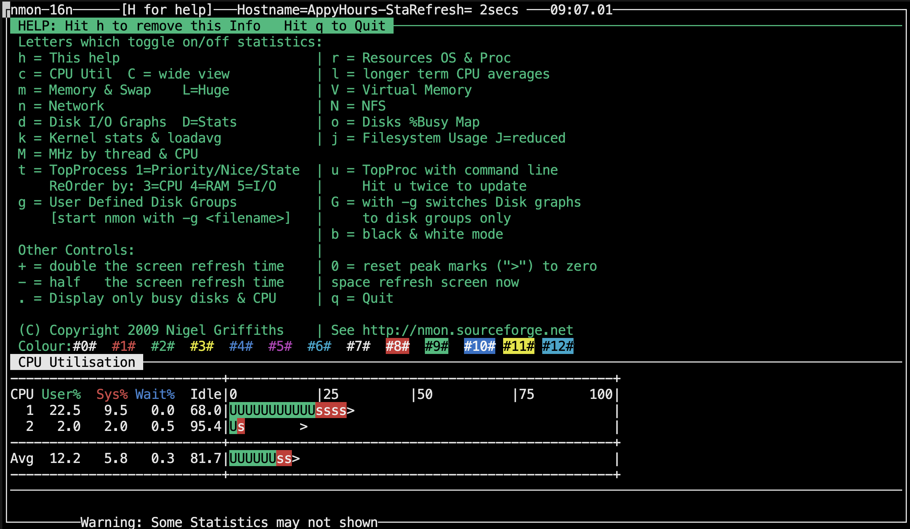
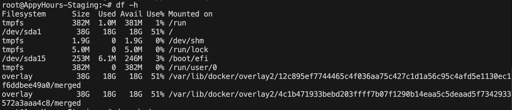

# 📘 System Monitoring Setup

This guide helps you monitor CPU, memory, disk, and process usage on a Linux system using simple command-line tools. It includes a script that logs metrics every 12 hours and stores them in date-wise folders.

---

## 🔧 Installation

Install the required monitoring tools:

```bash
# Install htop
sudo apt install htop -y

# Install nmon
sudo apt install nmon -y
```

---

## 📊 Monitoring Tools

### ✅ htop

Interactive system monitor to view CPU, memory, and process usage.


---

### ✅ nmon

Performance monitor with CPU, memory, disk, and network stats.



---

## 💽 Disk Usage Monitoring

### ✅ df -h

Shows filesystem disk space usage in human-readable format.

```bash
df -h
```



---

### ✅ du -sh /

Shows the total disk usage of the root (`/`) directory.

```bash
du -sh /
```


---

## 📝 `monitor.sh` – Logging Script

Create a file named `monitor.sh` and paste the following:

```bash
#!/bin/bash

# Base log directory
BASE_LOG_DIR="/var/log/monitoring"

# Get today's date (e.g., 2025-07-06)
TODAY=$(date +%F)

# Create daily folder: /var/log/monitoring/2025-07-06
DAILY_LOG_DIR="$BASE_LOG_DIR/$TODAY"

# Create the directory if it doesn't exist
if [ ! -d "$DAILY_LOG_DIR" ]; then
    echo "Creating log directory at $DAILY_LOG_DIR"
    sudo mkdir -p "$DAILY_LOG_DIR"
    sudo chmod 755 "$DAILY_LOG_DIR"
fi

# Get current time for file naming
TIMESTAMP=$(date +%H-%M-%S)

# File paths
TOP_LOG="$DAILY_LOG_DIR/top_$TIMESTAMP.log"
DF_LOG="$DAILY_LOG_DIR/df_$TIMESTAMP.log"
DU_LOG="$DAILY_LOG_DIR/du_$TIMESTAMP.log"
PROCESS_LOG="$DAILY_LOG_DIR/process_$TIMESTAMP.log"

# Generate monitoring logs
echo "Collecting system monitoring data..."

# Top command (CPU/mem/processes)
top -b -n1 > "$TOP_LOG"

# Disk usage
df -h > "$DF_LOG"

# Root folder size
du -sh / > "$DU_LOG"

# Top 10 memory-hungry processes
ps -eo pid,ppid,cmd,%mem,%cpu --sort=-%mem | head -n 11 > "$PROCESS_LOG"

echo "Monitoring logs stored in $DAILY_LOG_DIR"
```

---

## 🚀 Run the Script

Make the script executable and run it:

```bash
chmod +x monitor.sh
./monitor.sh
```

**Output screenshots:**

  


---

## ⏰ Automate with Cron

To run the script every **12 hours**, open crontab:

```bash
crontab -e
```

Add this line:

```cron
0 */12 * * * /root/monitor.sh
```

> This runs the script at 00:00 and 12:00 daily.

---

## 📂 Log Output Structure


---

## ✅ Summary

| Tool       | Purpose                             |
|------------|-------------------------------------|
| htop       | Interactive resource monitoring     |
| nmon       | Detailed performance metrics        |
| df -h      | Disk usage per filesystem           |
| du -sh /   | Total usage of root directory       |
| top        | CPU, memory, process stats snapshot |
| ps         | Top memory-consuming processes      |

---

📌 Use this setup for continuous visibility into system health, early detection of issues, and capacity planning.
