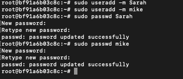
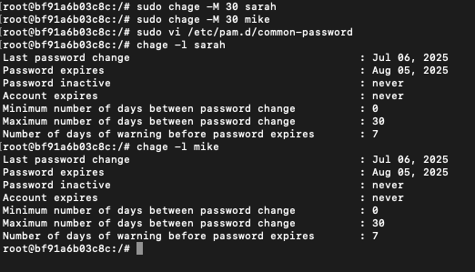
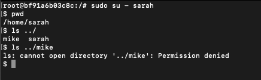

# Task 2: User Management and Access Control 

## Create Users with Secure Passwords

### Add users with home directories
```bash
sudo useradd -m sarah
sudo useradd -m mike
```

### Set passwords securely (will prompt for password input)
```bash
sudo passwd sarah
sudo passwd mike
```



---

## Create Isolated Workspace Directories

### Create the directories
```bash
sudo mkdir -p /home/sarah/workspace
sudo mkdir -p /home/mike/workspace
```

### Set ownership to respective users
```bash
sudo chown sarah:sarah /home/sarah/workspace
sudo chown mike:mike /home/mike/workspace
```

### Set permissions so only the owner can access
```bash
sudo chmod 700 /home/sarah/workspace
sudo chmod 700 /home/mike/workspace
```


---

## Set Password Expiration Policy

### Set password to expire in 30 days
```bash
sudo chage -M 30 sarah
sudo chage -M 30 mike
```

### Enforce Password Complexity
Edit the PAM configuration:
```bash
sudo vi /etc/pam.d/common-password
```

Add or modify this line:
```
password requisite pam_pwquality.so retry=3 minlen=8 ucredit=-1 lcredit=-1 dcredit=-1 ocredit=-1
```

**Explanation:**
- `minlen=8`: Minimum length
- `ucredit=-1`: Require at least 1 uppercase
- `lcredit=-1`: Require at least 1 lowercase
- `dcredit=-1`: Require at least 1 digit
- `ocredit=-1`: Require at least 1 special character

---

### Verify Password Policies
Check expiry details:
```bash
chage -l sarah
chage -l mike
```



---

### Test Access Controls
Switch to Sarah's account and try accessing Mike's workspace:
```bash
sudo su - sarah
ls ../mike   # This should give a permission denied error
```


