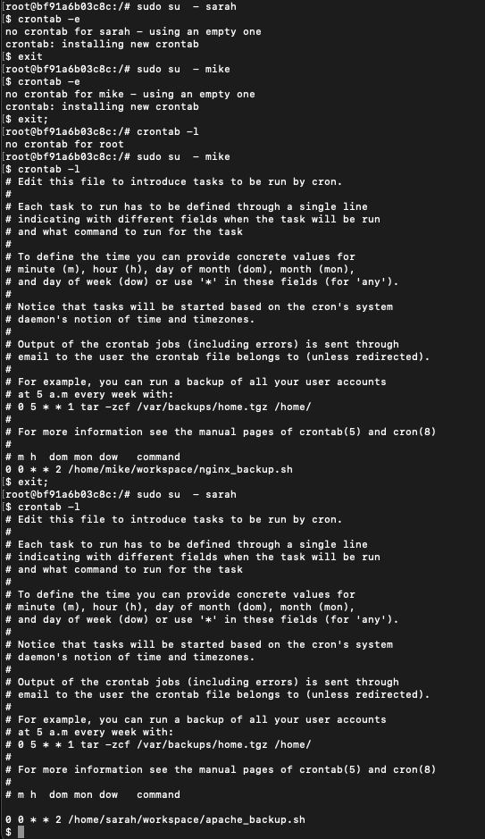

# Task 3: Backup Configuration for Web Servers

## Objective
Configure automated backups for Sarah's Apache server and Mike's Nginx server to ensure data integrity and recovery.

---

## 1. Install Apache and Nginx

### Update system packages
```bash
sudo apt update
```

### Install Apache
```bash
sudo apt install apache2 -y
```

### Install Nginx
```bash
sudo apt install nginx -y
```

### Start Apache and Nginx
```bash
sudo service apache2 start
sudo service apache2 status

sudo service nginx start
sudo service nginx status
```

> **Note:** Nginx is configured to listen on port `8080` instead of the default port `80` to avoid conflicts with Apache.


---

## 2. Create Backup Scripts

Create the `/backups` directory and assign permissions:
```bash
sudo mkdir -p /backups
sudo chown $USER:$USER /backups
```

### Apache Backup Script (for Sarah)
Create the script at: `/home/sarah/workspace/apache_backup.sh`

```bash
#!/bin/bash

DATE=$(date +%F)
BACKUP_DIR="/backups"
BACKUP_FILE="${BACKUP_DIR}/apache_backup_${DATE}.tar.gz"
VERIFY_LOG="${BACKUP_DIR}/apache_verify_${DATE}.log"

# Ensure backup directory exists
mkdir -p "$BACKUP_DIR"

# Create the verification log file if it doesn't exist
if [ ! -f "$VERIFY_LOG" ]; then
    touch "$VERIFY_LOG"
fi

# Perform the backup
tar -czf "$BACKUP_FILE" /etc/apache2/ /var/www/html/

# Verify the backup
echo "Apache backup verification - $DATE" > "$VERIFY_LOG"
tar -tzf "$BACKUP_FILE" >> "$VERIFY_LOG"
```

Make it executable:
```bash
sudo chmod +x /home/sarah/workspace/apache_backup.sh
```

### Nginx Backup Script (for Mike)
Create the script at: `/home/mike/workspace/nginx_backup.sh`

```bash
#!/bin/bash

DATE=$(date +%F)
BACKUP_DIR="/backups"
BACKUP_FILE="${BACKUP_DIR}/nginx_backup_${DATE}.tar.gz"
VERIFY_LOG="${BACKUP_DIR}/nginx_verify_${DATE}.log"

# Ensure backup directory exists
mkdir -p "$BACKUP_DIR"

# Create the verification log file if it doesn't exist
if [ ! -f "$VERIFY_LOG" ]; then
    touch "$VERIFY_LOG"
fi

# Perform the backup
tar -czf "$BACKUP_FILE" /etc/nginx/ /usr/share/nginx/html/

# Verify the backup
echo "Nginx backup verification - $DATE" > "$VERIFY_LOG"
tar -tzf "$BACKUP_FILE" >> "$VERIFY_LOG"
```

Make it executable:
```bash
sudo chmod +x /home/mike/workspace/nginx_backup.sh
```

---

## 3. Set Up Cron Jobs (Every Tuesday at 12:00 AM)

Edit the cron jobs using:
```bash
crontab -e
```

Add the following entries:
```cron
# Sarah (Apache backup)
0 0 * * 2 /home/sarah/workspace/apache_backup.sh

# Mike (Nginx backup)
0 0 * * 2 /home/mike/workspace/nginx_backup.sh
```

List existing cron jobs:
```bash
crontab -l
```



---

## ✅ Result
- Backup files are stored in `/backups/` with date-based filenames.
- Verification logs confirm the integrity of each backup.
- Automated scheduling ensures weekly consistency.
