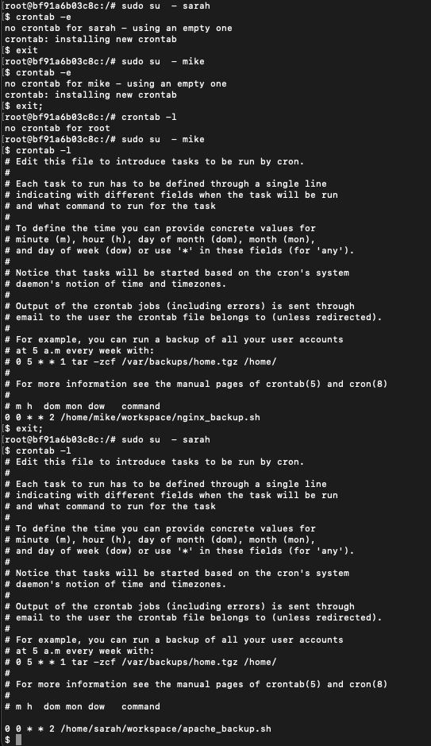

Task 3: Backup Configuration for Web Servers

# Install Apache and Nginx

## Update system packages
sudo apt update

## Install Apache
sudo apt install apache2 -y

## Install Nginx
sudo apt install nginx -y

## Start Apache and Nginx
sudo service apache2 start
sudo service apache2 status

sudo service nginx start
sudo service nginx status
Note: nginx port is pointed to 8080 in "/etc/nginx/sites-available/default" to avoid conflict with apache

# Create Backup Script
We’ll create two separate scripts: one for Sarah (Apache), one for Mike (Nginx). Both will:
	1.	Compress configuration and document root.
	2.	Save with a timestamp in /backups/.
	3.	Verify backup by listing the contents of the tar file.

sudo mkdir -p /backups
sudo chown $USER:$USER /backups

apache_backup.sh

#!/bin/bash

DATE=$(date +%F)
BACKUP_DIR="/backups"
BACKUP_FILE="${BACKUP_DIR}/apache_backup_${DATE}.tar.gz"
VERIFY_LOG="${BACKUP_DIR}/apache_verify_${DATE}.log"

# Ensure backup directory exists
mkdir -p "$BACKUP_DIR"

# Create the verification log file if it doesn't exist
if [ ! -f "$VERIFY_LOG" ]; then
    touch "$VERIFY_LOG"
fi

# Perform the backup
tar -czf "$BACKUP_FILE" /etc/apache2/ /var/www/html/

# Verify the backup
echo "Apache backup verification - $DATE" > "$VERIFY_LOG"
tar -tzf "$BACKUP_FILE" >> "$VERIFY_LOG"

Make executable:
sudo chmod +x /home/sarah/workspace/apache_backup.sh

nginx_backup.sh

#!/bin/bash

DATE=$(date +%F)
BACKUP_DIR="/backups"
BACKUP_FILE="${BACKUP_DIR}/nginx_backup_${DATE}.tar.gz"
VERIFY_LOG="${BACKUP_DIR}/nginx_verify_${DATE}.log"

# Ensure backup directory exists
mkdir -p "$BACKUP_DIR"

# Create the verification log file if it doesn't exist
if [ ! -f "$VERIFY_LOG" ]; then
    touch "$VERIFY_LOG"
fi

# Perform the backup
tar -czf "$BACKUP_FILE" /etc/nginx/ /usr/share/nginx/html/

# Verify the backup
echo "Nginx backup verification - $DATE" > "$VERIFY_LOG"
tar -tzf "$BACKUP_FILE" >> "$VERIFY_LOG"

Make executable:
sudo chmod +x /home/mike/workspace/nginx_backup.sh

## Set Up Cron Jobs (Every Tuesday at 12:00 AM)

crontab -e

# Sarah (Apache backup)
0 0 * * 2 /home/sarah/workspace/apache_backup.sh

# Mike (Nginx backup)
0 0 * * 2 /home/mike/workspace/nginx_backup.sh

crontab -l
